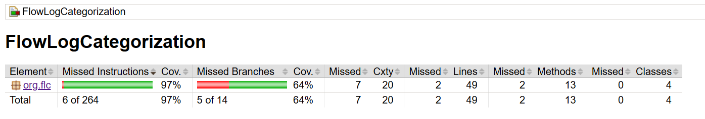

# Flow Log Tagger

## Introduction

Flow Log Tagger is a scalable and efficient Java application that processes flow log data, assigns tags based on a lookup table, and aggregates tagged data. This system is designed to handle large-scale log files efficiently using multi-threading.

## Assumptions Made

- Log version will always be 2.
- Lookup table structure will not change

## Features

- Efficiently parses and processes large flow log files (up to **1GB**)
- Uses a **lookup table** to map flow logs to appropriate tags
- Supports **multi-threaded processing** for high performance
- Providing **logging** using **SLF4J**
- Provides output with **aggregated tag counts**
- Includes **unit testing** with high test coverage using **JaCoCo**
- Supports **load testing**

## Setup & Execution

### Prerequisites

- **Java 11 or higher**
- **Maven** (for dependency management)

### Installation

1. Clone the repository:

   ```sh
   git clone https://github.com/mahima-14-umass/FlowLogCategorization.git
   cd FlowLogCategorization
   ```

2. Build the project:

    ```sh
   mvn clean install
   ```

### Execution

Run the application:

   ```sh
   java -jar target/FlowLogCategorization-1.0.jar
   ```

This will process the flow logs from src/main/resources/flowlogs.txt and generate output in **src/main/resources/output.csv**.
Logs are store in the **logs/application.log file**

## Implementation & Documentation
The project is structured as follows:

### Main Components:

**FlowLogTagger.java** - Entry point for the application.

**FlowLogProcessor.java** - Handles parsing and processing of logs.

**LookupTableLoader.java** - Loads lookup and protocol mappings.

**TagCounter.java** - Aggregates tagged data.

**FileUtil.java** - Handles file read/write operations efficiently.

### Generating JavaDoc

To generate documentation:

```sh
mvn javadoc:javadoc
```

This will generate the JavaDoc files. Please refer to the target/reports/apidocs/org/flc/FlowLogTagger.html to check the documentation.

## Unit Testing
Unit tests are implemented using JUnit and Mockito. To run all tests:

```shell
mvn test
```

## Code Coverage with JaCoCo
JaCoCo is used to measure test coverage. To generate a coverage report:

```shell
mvn jacoco:report
```
This will generate a coverage report in target/site/jacoco/index.html.



## Load Testing

The class FlowLogTaggerLoadTest.java performs the load testing by generation a sample flowlogs_loadtesting.txt of 10MB and Lookup table having 10000 entries.
Run the class using the following command:
```shell
mvn test -Dtest=FlowLogTaggerLoadTest
```
The output is as follow:
```shell
Resource Usage :: 
File Size: 10.0 MB
Total Execution Time: 0.984 sec
Memory Used: 83493 KB
```

## Expected Output

After processing logs, the output will contain:

```shell
Tag,Count
sv_P2,1
sv_P1,2
email,3
Untagged,8
```

And the Port/Protocol Combination Counts:

```shell
Port/Protocol Combination Counts:
Port,Protocol,Count
1024,tcp,1
110,tcp,1
143,tcp,1
23,tcp,1
25,tcp,1
443,tcp,1
49153,tcp,1
49154,tcp,1
49155,tcp,1
49156,tcp,1
49157,tcp,1
49158,tcp,1
80,tcp,1
993,tcp,1
```

## Conclusion
Flow Log Tagger is a high-performance log processing tool built for scalability and efficiency. It provides clear tagging, multi-threaded execution, and robust testing support.

## Reference
flow logs: https://docs.aws.amazon.com/vpc/latest/userguide/flow-log-records.html